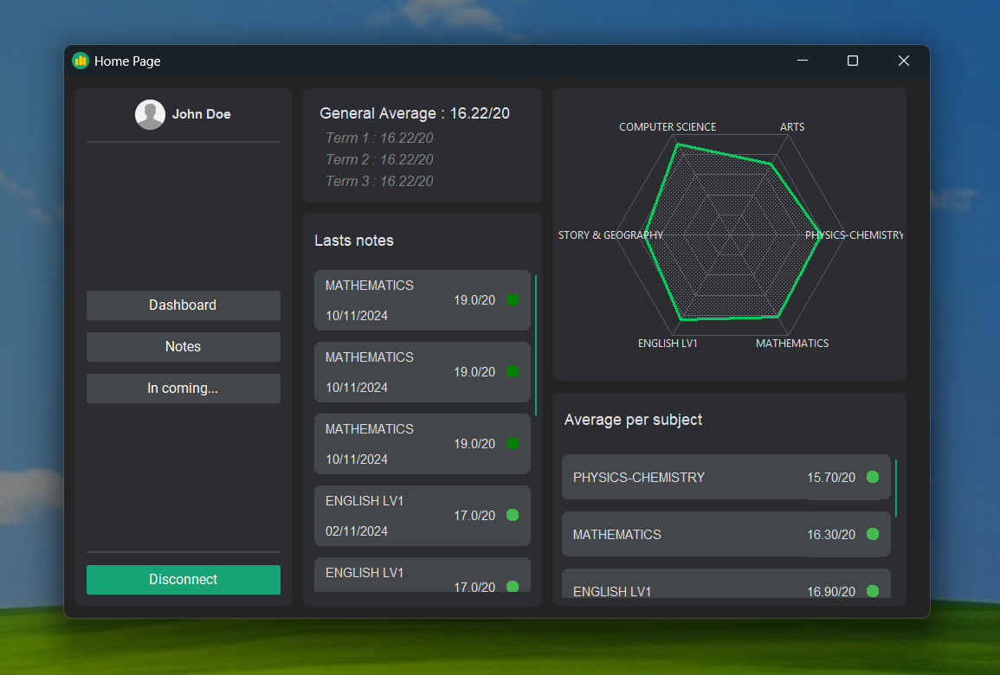
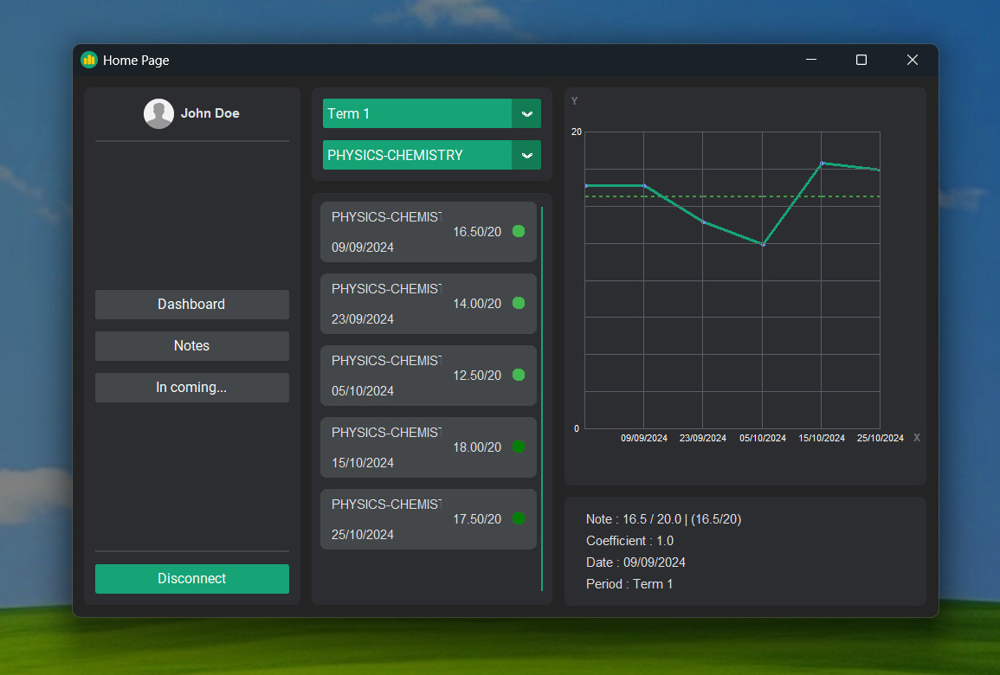
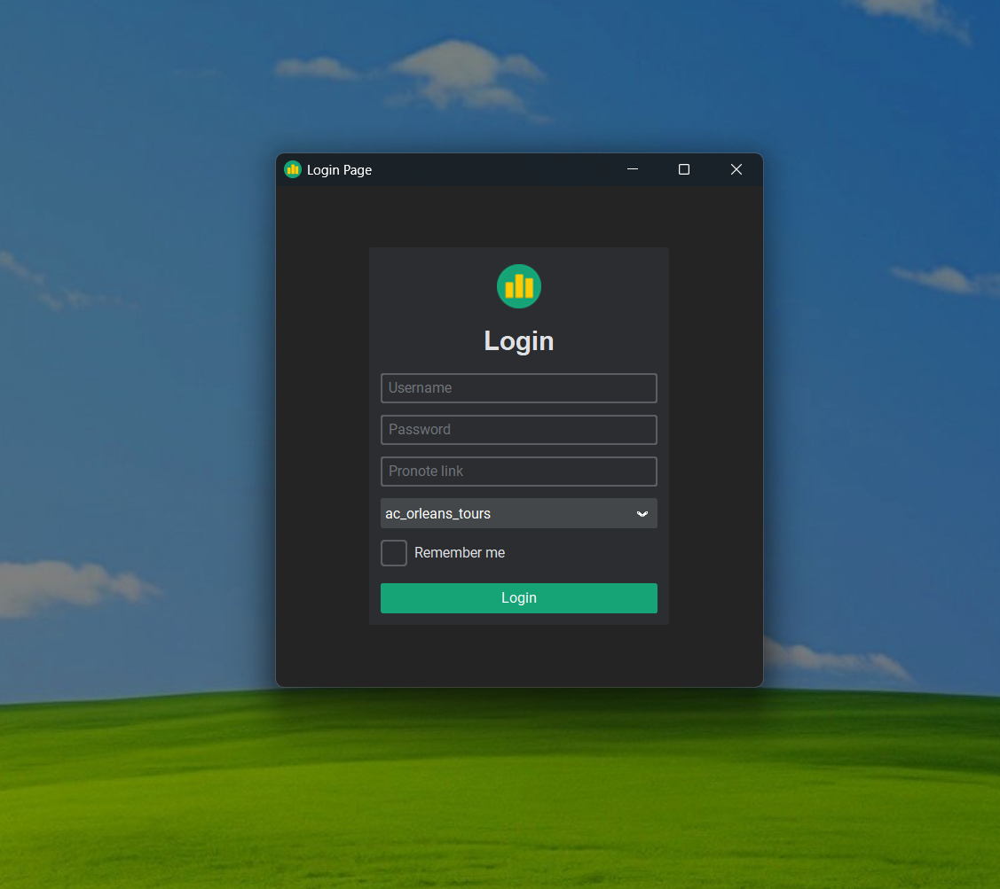

<div align="center">
  


# PyNote

***A Python application for managing your Pronote account with a modern graphical interface, allowing you to view notes effortlessly.***

[](https://github.com/MadeByRoucoule/PyNote/commits/main/)
[](https://github.com/MadeByRoucoule/PyNote)





</div>

## 🚀 Features

- 📚 **Pronote Integration**: Connect seamlessly to your Pronote account to fetch notes, timetables, and homework.
- 🗂 **Data Management**: View detailed information on grades and averages per period.
- 💾 **Data Export**: Save your Pronote data (notes, averages, etc.) to JSON and Excel files.
- 🔄 **Real-Time Updates**: Update displayed data automatically as you navigate through periods and subjects.

## Run the project

First, clone the repository :
```bash
git clone https://github.com/MadeByRoucoule/PyNote.git
cd PyNote
```
Then run the program with the following command (using [uv tool](https://github.com/astral-sh/uv), so install it before running the command - see [the documentation page on this](https://docs.astral.sh/uv/))
```bash
uv run "src/main.py"
```