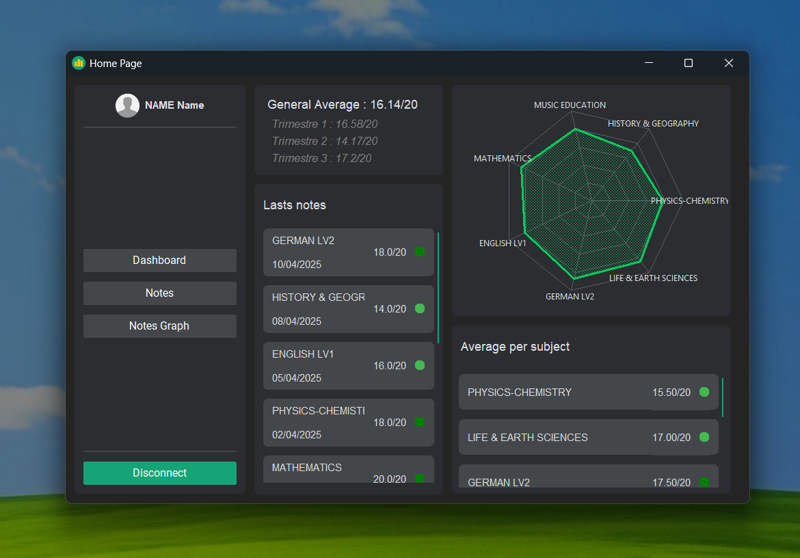
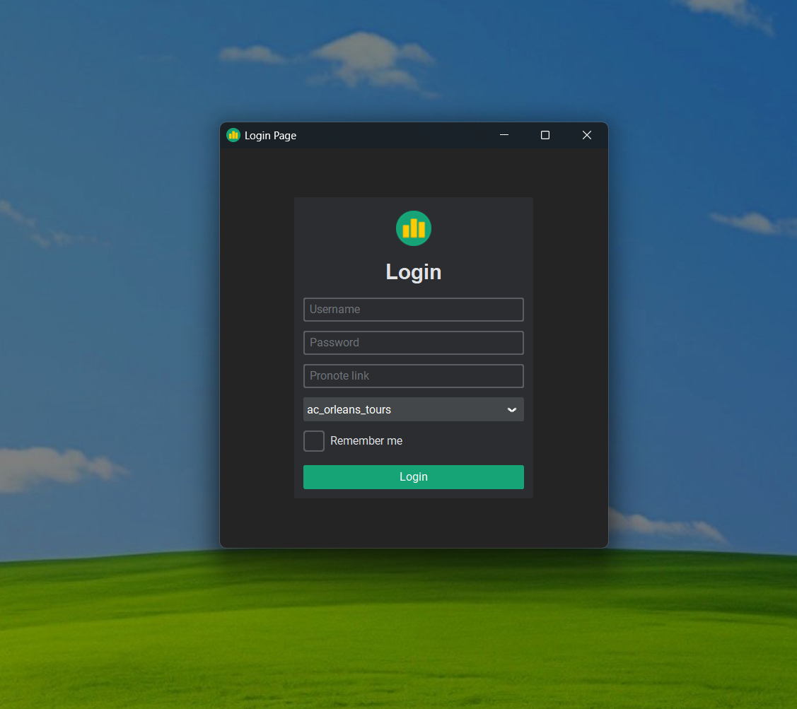

<div align="center">
  


# [PyNote]

***A Python application for managing your Pronote account with a modern graphical interface, allowing you to view notes effortlessly.***

[](https://github.com/MadeByRoucoule/PyNote/commits/main/)
[](https://github.com/MadeByRoucoule/PyNote)

 

</div>

> [!IMPORTANT]
> **🚀 Project in development!**

## 🚀 Features

- 📚 **Pronote Integration**: Connect seamlessly to your Pronote account to fetch notes, timetables, and homework.
- 🗂 **Data Management**: View detailed information on grades and averages per period.
- 💾 **Data Export**: Save your Pronote data (notes, averages, etc.) to JSON and Excel files.
- ⚙️ **Settings Management**: Easily configure and persist your application settings.
- 🔄 **Real-Time Updates**: Update displayed data automatically as you navigate through periods and subjects.

## 🎭 Clone the Repository

```bash
git clone https://github.com/MadeByRoucoule/PyNote.git
cd PyNote
```

## 📦 Install the required dependencies:

```bash
pip install -r requirements.txt
```

## ▶️ Usage
Start the application:

```bash
cd PyNote
python src/main.py
```

## 🤝 Contributing
Contributions are welcome! Feel free to submit issues and pull requests to improve the project.

[PyNote]: https://github.com/MadeByRoucoule/PyNote
